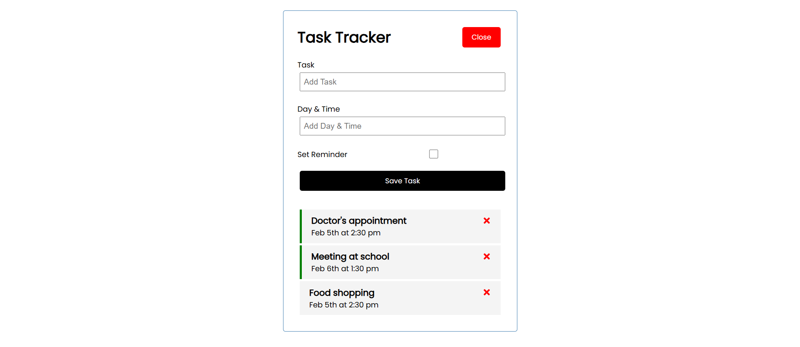
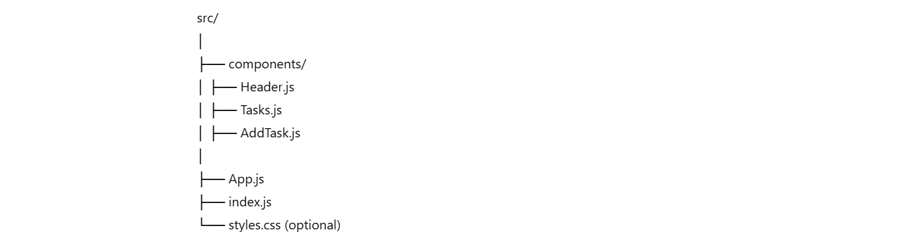

# 📋 Task Tracker App

A simple and interactive Task Tracker built with **React**. It allows users to add, delete, and set reminders for tasks. This project helps reinforce key React concepts such as **state management**, **props**, **component-based architecture**, and **event handling**.

---

## 🚀 Features

- ✅ Add new tasks with description and time
- ✅ Set reminders via checkbox
- ✅ Delete tasks with a single click
- ✅ Toggle reminders visually
- ✅ Conditionally render Add Task form
- ✅ Responsive and minimalist UI

---

## 🧱 Tech Stack

- **Frontend:** React (Hooks, JSX)
- **CSS:** Plain CSS or Tailwind (depending on your choice)
- **State Management:** useState (React Hooks)

---

## 📁 Project Structure

---

## 📦 Installation & Running

# 1. Clone the repository
git clone https://github.com/Shubhi-2211/task-tracker.git
cd task-tracker

# 2. Install dependencies
npm install

# 3. Run the development server
npm start

---

## Deployed at: (https://shubhiupadhyay-tasktracker-app.netlify.app/)
